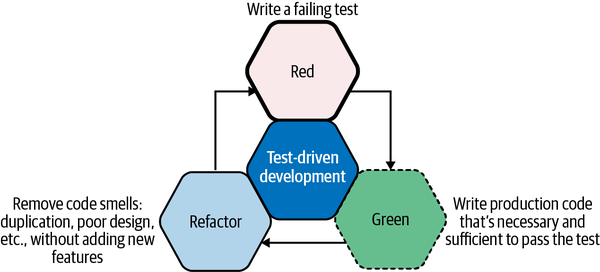

# Red-Green-Refactor

**Red**. We write a failing test (including possible compilation failures). We run the test suite to verify the failing tests.

**Green**. We write just enough production code to make the test green. We run the test suite to verify this.

**Refactor**. We remove any code smells. These may be due to duplication, hardcoded values, or improper use of language idioms (e.g., using a verbose loop instead of a built-in iterator). If we break any tests during refactoring, we prioritize getting them back to green before exiting this phase.

> This study is based on book [*Learning Test-Driven Development*](https://learning.oreilly.com/library/view/learning-test-driven-development/9781098106461/) by Saleem Siddiqui.
>
> Useful links:
>
> - [accompanying code repository](https://github.com/saleem/tdd-book-code)
> - [semantic commit message](https://gist.github.com/joshbuchea/6f47e86d2510bce28f8e7f42ae84c716)
